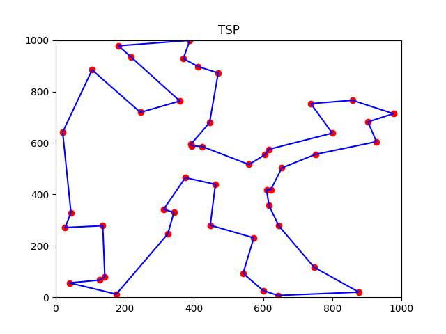
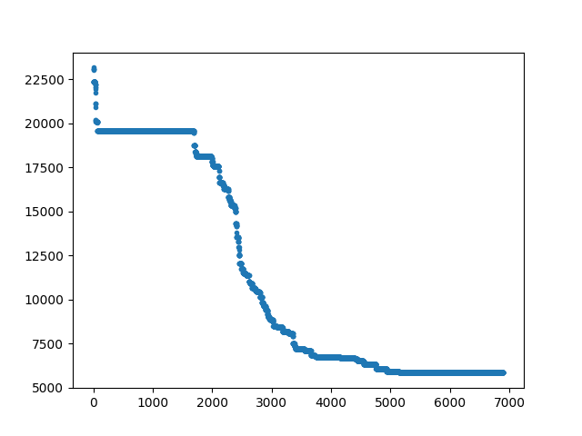

# tsp
Solving the TSP with simulated annealing in python and outputting some images

Here is a lower bound for the TSP with this SA annealing method. There is room for improvement. For instance the lines cross in some cases.

  

Here is the evolution of the distance of the best solutions over iterations.

  

